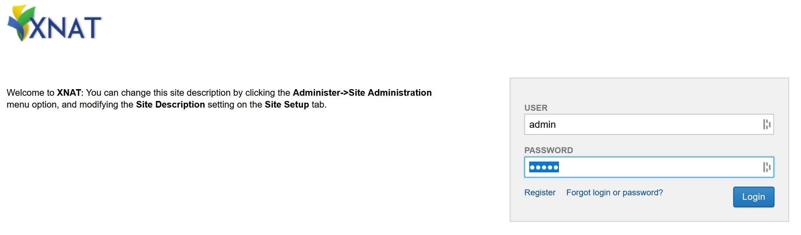
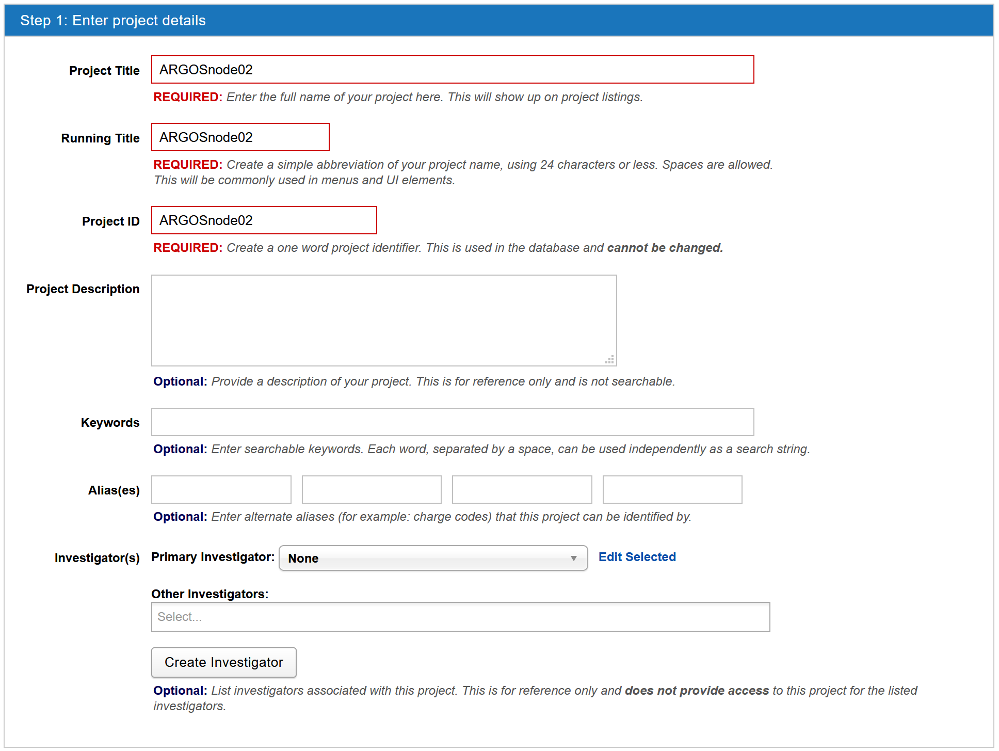
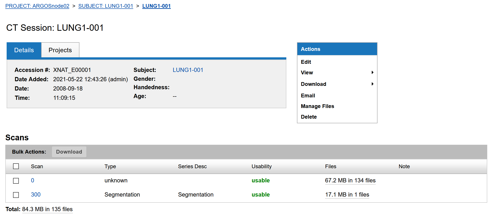

# ARtificial Intelligence for Gross tumour vOlume Segmentation (ARGOS)

## ARGOS Standard Procedures

### A : Setting up an ARGOS XNAT dicom collection for your clinic
_The objective of this part is to get a working XNAT docker instance set up locally on your clinic side, and prepare it to receive DICOM data_

Expand step-by-step instructions :

Step 1 : Ensure that you have sufficient space, memory and reasonably up to date hardware including ***at least 1 GPU chip***. For reference, the MAASTRO node is an Amazon AWS Ubuntu Linux 18.04 virtual machine with 10GBit network and 100GB storage (it happens to be the g3.xlarge template instance).

Step 2 : Install Docker Engine (free Community Edition version). Follow the instructions here - https://docs.docker.com/engine/install/ubuntu/

Step 3 : After validating that Docker is working (e.g. do the hello-world demo recommended at the end of the install documentation) please also install docker-compose (https://docs.docker.com/compose/install/).

Step 4 : Install the git library with `sudo apt-get install git`.

Step 5 : Find the XNAT docker-compose registry by the Washington University Neuro-imaging Research Group, and follow the instructions to clone their repository to your system, starting with the `git clone https://github.com/NrgXnat/xnat-docker-compose`.

Step 6 : Create an XNAT instance by switching directory into the xnat-docker-compose master folder `cd xnat-docker-compose` and then copy the default environment template to the .env file as `sudo cp default.env .env`.

Step 7 : Spin up the required XNAT components using docker-compose as follows `sudo docker-compose up -d`.

Step 8 : Depending on your system Step 7 could well take a few minutes to get set up. You can check status using the following command `sudo docker stats`. Once all three docker images in the XNAT package are stable at very low load, it probably means everything is up and running nice in the background.

Step 9 : On the same machine that is hosting your XNAT docker instance, you now need to point a web browser to http://localhost:80. The XNAT welcome screen should come up momentarily.

### B : Populating the XNAT dicom collection point with your clinical data
_The objective of this part is to get a populate your XNAT docker instance with de-identified DICOM data, the end point desired will be DICOM CT and DICOM SEGMENTATION file for each patient, with the primary lung GTV attached with the SNOMED CT attribute 86049000 (i.e. "Neoplasm, Primary)_

Expand step-by-step instructions :

Step 1 : On the XNAT welcome screen, you will log in as _admin_ and the password is _admin_.

Step 2 : Create a new project, for instance, I am calling mine "ARGOSnode02". This name is only visible on your side, no one else needs this, so feel free to label your collection as you wish.

Step 3 : There are now several options to populate the XNAT collection with your DICOM CT and DICOM RTSTRUCT (for most partners) or DICOM SEGMENTATION (for the minority of partners). We will provide you some of the data transfer options below.

**Note well : If using RTSTRUCT, please have primary lung tumour(s) named as 'GTV-1' (GTV-2, etc. if more than one primary in the lung). Malignant nodes are named as 'GTV-N1' ('GTV-N2', etc. if more than one node) or simply 'GTV-Nsum'. Organs at risk such as 'Esophagus', 'Heart', 'Lung-Left', 'Lung-Right', are all purely optional.**

##### Option 1 : Direct upload with python batching script
_This can only work with adequately de-identified and correctly-cleaned DICOM data_. We provide you with a python notebook script to iterate through every patient folder in a local filesystem directory, it will package each patient folder as a zip object, and then transmit the zip via API into your local XNAT docker instance which will collect it and try to archive it. This requires Python version 3.7 or later.

##### Option 2 : Clinical Trial Processor pipeline ending with DICOM transfer
_This is probably the most useful clinical-integrated workflow_. Here, we need to set you up with Clinical Trial Processor workflow that will (i) consume a copy of your DICOM files exported from your planning system or PACS (b) it will de-identify (using a key file) and change the GTV names (again using a lookup file) into the standard required above (c) it will send it across via standard DICOM protocol across the network to try to reach port number 8104 on your XNAT machine.
  * Download and install Java JRE/JDK _version 8_ (no higher than 8 please)
  * Download and install CTP as per the guidance here : https://mircwiki.rsna.org/index.php?title=MIRC_CTP
  * Extract the contents of the zip package called 'ctp_config_dicom' and replace the files in your CTP directory if needed.
  * Please follow the README notes in this zip package to set up your de-identification and GTV renaming correctly.

##### Option 3 : Clinical Trial Processor pipeline ending with HTTPS transfer
_This is probably one of the options for partners that want to move clinical data to a university department that hosts the ARGOD node_. This will be again done with Clinical Trial Processor and works the same as Option 2 above, except we will send via HTTPS protocol. There needs to be some additional setting up on the XNAT receiving side, but we will have someone from Medical Data Works give you some guidance for this part.
  * Download and install Java JRE/JDK _version 8_ (no higher than 8 please)
  * Download and install CTP as per the guidance here : https://mircwiki.rsna.org/index.php?title=MIRC_CTP
  * Extract the contents of the zip package called 'ctp_config_https' and replace the files in your CTP directory if needed.
  * Please follow the README notes in this zip package to set up your de-identification and GTV renaming correctly.

Step 4 : First try a testrun with a dummy case (eg delineated RANDO phantom, or use one of our public access cases from The Cancer Imaging Archive). This is to make sure the transfer into XNAT is going as expected. Try downloading this dummy case back from XNAT and open it with your Dicom tools; check if it compares well to the original (must be same other than patient de-identification and GTV renaming). An example of one of my cases in XNAT is in the screenshot below, you see this one has multiple CT slices and one single SEG (or RTSTRUCT if this is your case) assigned to this patient.

### C : Access to machine where the deep learning will run locally
You will need a deep learning machine where you can hold images until needed for the training run, and have the following hardware requirements. These requirements are also stated in Section 4.1 of the study protocol.
 
- We strongly recommend ***Ubuntu 18.04 LTS*** operating system
- ***Python version 3.7 or higher***
- ***Docker Desktop*** community edition (free)
- ***At least 1 GPU with the most up to date drivers; we plan to use TensorFlow v2.4 so we need updated GPU drivers***
- ***At least 16GB of RAM***
- At least ***50GB of disk space but more space will be much better*** (50GB corresponds very roughly to 100 patients with 1 Lung CT study and 1 RTSTRUCT file each)
- The clinic researcher needs to have local admin rights on this deep learning machine
- Local IP address and port for HTTPS (we will tell you which port number to enable)

